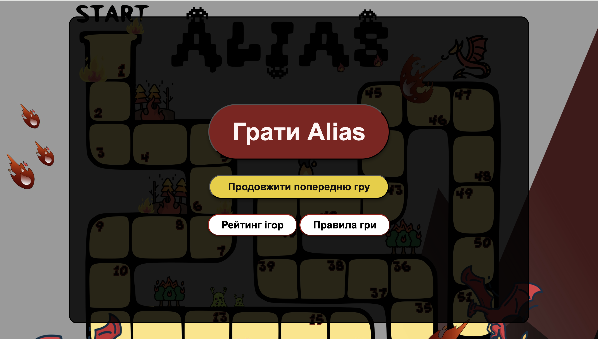
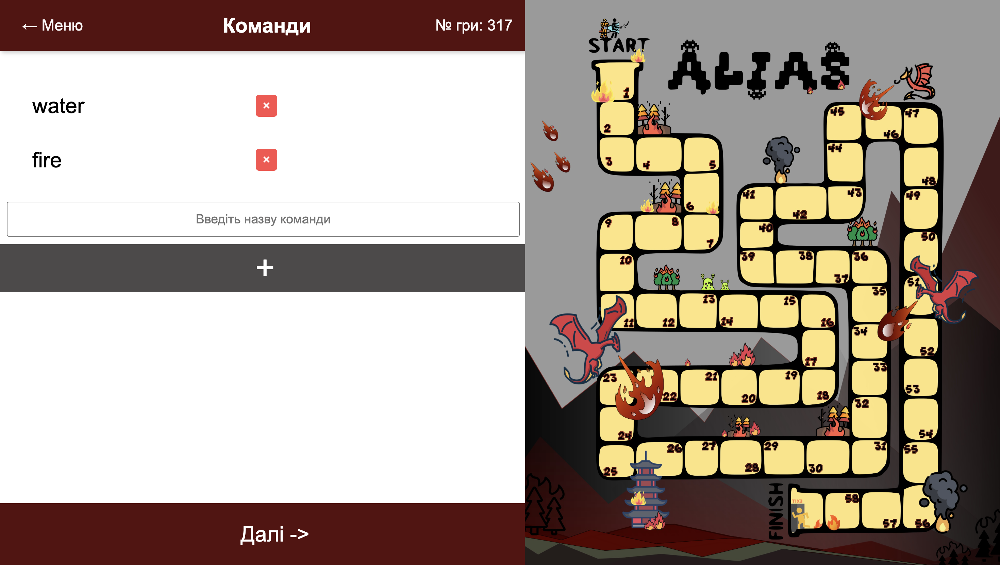
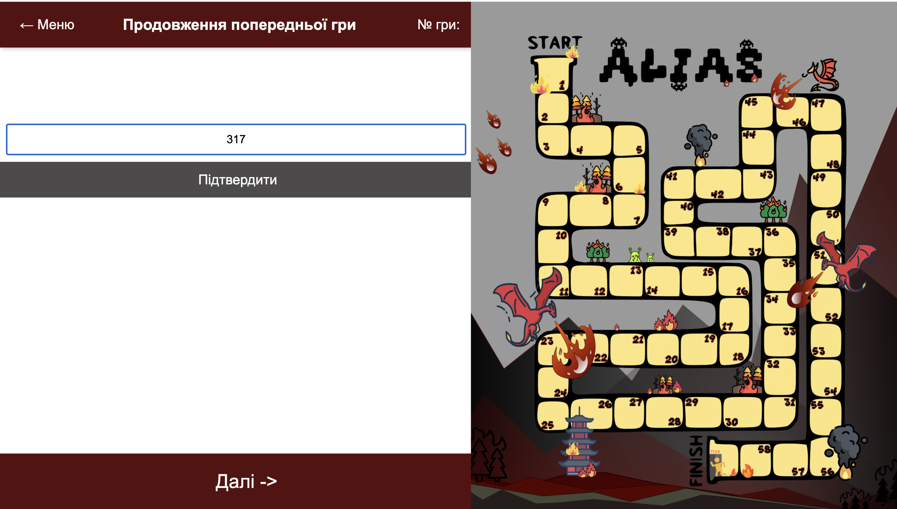
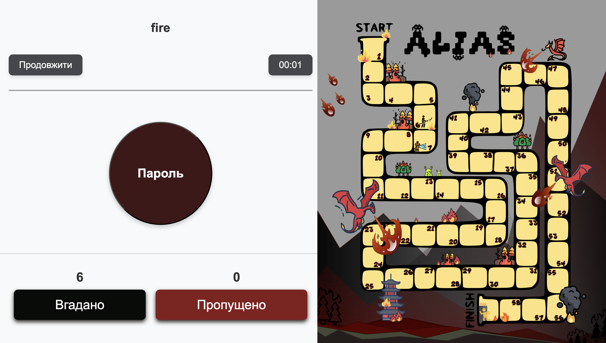
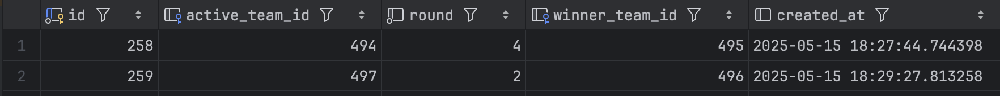
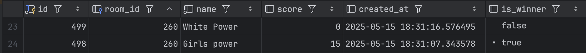

# 🎲 Alias Game — Fullstack Project

**Сайт для гри в Аліас** з повноцінною інтерактивною логікою, ігровим полем, таймером, рейтингом та можливістю створювати і продовжувати ігри.

---



---

# 🚀 Основні Можливості
* **Створення гри:** Можливість почати нову гру, створивши від 2 до 5 унікальних команд.

* **Інтерактивне поле:** Візуальне ігрове поле, де фішки команд рухаються відповідно до набраних очок, імітуючи справжню настільну гру.

* **Ігровий процес:**

  * Таймер раунду, який можна призупинити та відновити.

  * Підрахунок "Вгадано" та "Пропущено" слів за раунд.

  * Автоматичне збереження прогресу у localStorage.

* **Продовження гри:** Можливість відновити попередню незавершену гру за її унікальним ID.

* **Рейтинг ігор:** Таблиця з рейтингом ігор за часом проходження.

# 🧩 Основний функціонал

### ✔️ Створення гри та команд

* Користувач вводить назви команд (2–5 команд).
* У базі створюється **кімната (`room`)**, а для кожної команди — запис у таблиці `teams`.
* Команди мають мати різні назви.
* Після старту збереження гри відбувається **і в localStorage, і в БД**.



### ✔️ Продовження гри

Можна ввести ID гри (roomId) та продовжити гру:



❗️ Якщо гра завершена, її не можна продовжити — показується алерт.

### ✔️ Ігрове поле

* Відображає реальний рух фішки команди по клітинках (настільна механіка).
* Кожна вгадана/пропущена дія змінює прогрес.




### ✔️ Таймер

* доступний старт, пауза, продовження;
* використання `setInterval` без втрати часу при переходах;
* час кожної команди зберігається в БД (`duration_seconds`).

---

# Технології
* **Frontend:** HTML5, CSS3, Vanilla JavaScript (ES6+ Modules), Vite.

* **Backend:** Node.js, Express.js, REST API.

* **База даних:** PostgreSQL.

* **Оточення:** Docker.

---

# Структура бази даних

### Таблиця `rooms`




### Таблиця `teams`




# Збереження стану гри

### Збереження:

```js
export function saveModel(){
    localStorage.setItem("room", JSON.stringify(model));
}
```

### Завантаження:

```js
export function readStorage(){
    const savedData = JSON.parse(localStorage.getItem("room"));
    if (savedData) model = savedData;
}
```

Frontend модель виглядає так:

```js
export let model = {
    roomId: 0,
    teams: [],
    activeTeamIndex: null,
    round: 1,
    guessed: 0,
    skip: 0,
    winner: null,
    durationSeconds: 0,
}
```

---
